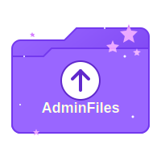

<div align="center">
  
# 🔐 AdminFiles



**Secure, Modern Cloud Storage for Your Most Important Files**

[](https://www.rust-lang.org/)
[](https://reactjs.org/)
[](https://www.docker.com/)
[](LICENSE)

<p align="center">
  <a href="#-features">Features</a> •
  <a href="#-installation">Installation</a> •
  <a href="#-configuration">Configuration</a> •
  <a href="#-usage">Usage</a> •
  <a href="#-security">Security</a> •
  <a href="#%EF%B8%8F-api">API</a> •
  <a href="#-deployment">Deployment</a>
</p>

</div>

---

## 🌟 Overview

AdminFiles is a self-hosted cloud storage platform designed with security and aesthetics in mind. Built with a modern tech stack featuring Rust on the backend and React on the frontend, it offers a sleek, neon purple interface for managing your files securely from any device.

Ideal for individuals and small teams who need a private, controlled environment for file storage without relying on public cloud services. AdminFiles puts you in control of your data while providing a beautiful, intuitive user experience.

---

## ✨ Features

### 🔐 Authentication & Security
- **Secure Login System** - JWT-based authentication
- **Password Protection** - Bcrypt hashing with salt
- **SQL Injection Prevention** - Parameterized queries
- **Backend Route Protection** - Access control for all sensitive operations

### 📁 File Management
- **Multi-format Support** - Upload any file type (images, PDFs, documents, etc.)
- **File Organization** - Organized view of all your uploads
- **Quick Download** - One-click file retrieval
- **Drag & Drop** - Intuitive file upload interface

### 🎨 User Experience
- **Modern Design** - Sleek, neon purple aesthetic
- **Responsive Interface** - Works on desktops, tablets, and phones
- **Dark Mode** - Easy on the eyes, day or night
- **Progress Tracking** - Visual feedback during uploads

### 🛠️ Technical Features
- **RESTful API** - Well-structured backend API
- **Containerized** - Full Docker support
- **Cross-platform** - Works on all major platforms
- **SQLite Database** - Simple but effective data storage

---

## 🔧 Tech Stack

<table align="center">
  <tr>
    <td align="center"><b>Backend</b></td>
    <td align="center"><b>Frontend</b></td>
    <td align="center"><b>Deployment</b></td>
  </tr>
  <tr>
    <td>
      • <b>Rust</b> - Systems programming language<br>
      • <b>Actix-web</b> - Web framework<br>
      • <b>SQLx</b> - Database layer<br>
      • <b>SQLite</b> - Database<br>
      • <b>JWT</b> - Authentication<br>
      • <b>Bcrypt</b> - Password hashing
    </td>
    <td>
      • <b>React</b> - UI library<br>
      • <b>Material-UI</b> - Component library<br>
      • <b>React Router</b> - Navigation<br>
      • <b>Axios</b> - API communication<br>
      • <b>React Dropzone</b> - File upload
    </td>
    <td>
      • <b>Docker</b> - Containerization<br>
      • <b>Docker Compose</b> - Multi-container<br>
      • <b>Nginx</b> - Web server<br>
      • <b>Traefik</b> - Reverse proxy (optional)<br>
      • <b>Cloudflare Tunnels</b> - Secure access
    </td>
  </tr>
</table>

---

## 🚀 Installation

### Prerequisites

- [Docker](https://docs.docker.com/get-docker/) and [Docker Compose](https://docs.docker.com/compose/install/)
- [Git](https://git-scm.com/downloads) (optional, for cloning)

### Quick Start

```bash
# Clone the repository
git clone https://your-repository-url/AdminFiles.git
cd AdminFiles

# Set environment variables (optional)
echo "JWT_SECRET=your_secure_secret_key" > .env

# Build and start containers
docker compose up -d

# Access AdminFiles at http://localhost or your configured domain
```

### Manual Setup (Development)

<details>
<summary>Click to expand</summary>

#### Backend Setup

```bash
cd backend

# Install Rust (if not already installed)
curl --proto '=https' --tlsv1.2 -sSf https://sh.rustup.rs | sh

# Build and run
cargo build
cargo run
```

#### Frontend Setup

```bash
cd frontend

# Install Node.js dependencies
npm install

# Start development server
npm start
```

</details>

---

## 🔧 Configuration

AdminFiles can be configured through environment variables or by editing configuration files.

### Environment Variables

| Variable | Description | Default |
|----------|-------------|---------|
| `DATABASE_URL` | SQLite database URL | `sqlite:admin_files.db` |
| `JWT_SECRET` | Secret key for JWT tokens | `your_super_secret_key_for_jwt_tokens` |
| `JWT_EXPIRED_IN` | JWT token expiration | `60m` |
| `JWT_MAX_AGE` | JWT token max age in minutes | `60` |
| `HOST` | Backend server host | `127.0.0.1` |
| `PORT` | Backend server port | `8080` |

### Docker Compose Configuration

The `docker-compose.yaml` file contains settings for:

- Container names
- Port mappings
- Volume mounts
- Networks
- Traefik labels (for routing)

### Customizing the Interface

You can customize the UI by editing the theme variables in:
- `frontend/src/assets/styles/theme.css`
- `frontend/src/App.js` (MUI theme settings)

---

## 📚 Usage

### User Management

1. **Register**: Create a new account with username, email, and password
2. **Login**: Access your files securely
3. **User Profile**: View and manage your account details

### File Operations

1. **Upload**:
   - Click the "Upload" button
   - Drag & drop files or click to select
   - View upload progress

2. **Download**:
   - Click the download icon next to any file
   - Files open or save based on browser settings

3. **Delete**:
   - Click the delete icon next to any file
   - Confirm deletion

### Screenshots

<details>
<summary>Login Screen</summary>

</details>

<details>
<summary>Dashboard</summary>

</details>

<details>
<summary>File Upload</summary>

</details>

---

## 🔒 Security

AdminFiles implements several security best practices:

- **Password Storage**: Bcrypt hashing with salt
- **Authentication**: JWT tokens with expiration
- **SQL Protection**: Parameterized queries prevent injection
- **File Validation**: Type and size checking
- **Path Traversal Prevention**: Sanitized filenames
- **CORS Configuration**: Controlled cross-origin requests
- **Content Security**: Proper headers and mime-type detection

### Security Recommendations

1. **Change Default Secrets**: Always change the default JWT secret
2. **HTTPS**: Use Cloudflare Tunnels or another SSL solution
3. **Regular Updates**: Keep all components updated
4. **Access Control**: Restrict server access to trusted users
5. **Backups**: Regularly backup your database and uploaded files

---

## ⚙️ API

AdminFiles exposes a RESTful API for authentication and file management.

### Authentication Endpoints

| Method | Endpoint | Description |
|--------|----------|-------------|
| POST | `/api/auth/register` | Register a new user |
| POST | `/api/auth/login` | Login and receive JWT token |
| GET | `/api/auth/me` | Get current user information |

### File Management Endpoints

| Method | Endpoint | Description |
|--------|----------|-------------|
| GET | `/api/files` | List all user files |
| POST | `/api/files/upload` | Upload a new file |
| GET | `/api/files/{id}/download` | Download a file |
| DELETE | `/api/files/{id}` | Delete a file |

<details>
<summary>API Examples</summary>

#### Login Request
```json
POST /api/auth/login
{
  "email": "user@example.com",
  "password": "secure_password"
}
```

#### Login Response
```json
{
  "token": "eyJhbGciOiJIUzI1NiIsInR5cCI6IkpXVCJ9...",
  "user": {
    "id": 1,
    "username": "user",
    "email": "user@example.com"
  }
}
```

</details>

---

## 📦 Deployment

### Docker Deployment (Recommended)

The simplest way to deploy AdminFiles is using Docker Compose:

```bash
docker compose up -d
```

This will:
1. Build both frontend and backend images
2. Set up the required network
3. Mount volumes for persistent data
4. Start all services

### Cloudflare Tunnel Integration

For secure, public access to your AdminFiles instance:

1. Set up a Cloudflare Tunnel in the Zero Trust dashboard
2. Configure the tunnel to point to your AdminFiles frontend:
   - Service: `HTTP`
   - URL: `adminfiles-frontend:80` or `frontend:80`
3. Add a DNS record for your domain (e.g., `adminfiles.yourdomain.com`)

### Traefik Configuration

If using Traefik as your reverse proxy (as configured in docker-compose.yaml):

1. Ensure Traefik is running and properly configured
2. The labels in docker-compose.yaml will automatically register routes
3. Point your Cloudflare Tunnel to Traefik instead of directly to the containers

---

## 🔄 Updating

To update AdminFiles to the latest version:

```bash
# Pull the latest changes
git pull

# Rebuild and restart containers
docker compose up -d --build
```

---

## 🤝 Contributing

Contributions to AdminFiles are welcome! Whether it's bug reports, feature requests, or code contributions.

1. Fork the repository
2. Create a feature branch (`git checkout -b feature/amazing-feature`)
3. Commit your changes (`git commit -m 'Add some amazing feature'`)
4. Push to the branch (`git push origin feature/amazing-feature`)
5. Open a Pull Request

---

## 📄 License

This project is licensed under the [MIT License](https://github.com/AdminGodZ/AdminFiles/blob/main/LICENSE) - see the LICENSE file for details.

---

## 💬 Support

If you encounter any issues or have questions, please file an issue on the GitHub repository or visit our contact page at https://admingod.ch/ for support.

---

<div align="center">
  
### AdminFiles - Your files, your control, your style.

</div>
